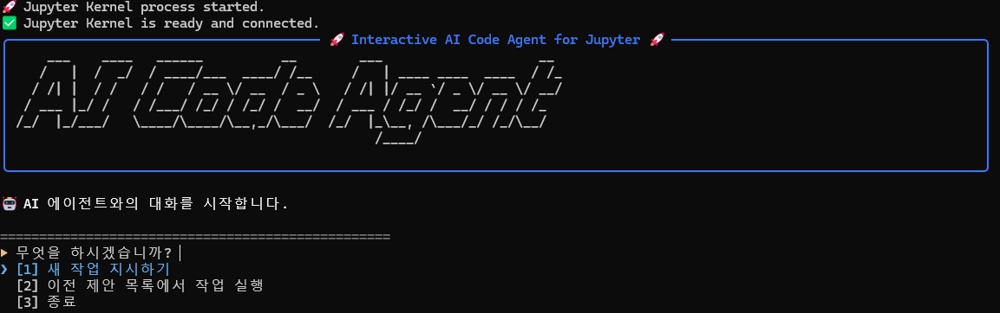
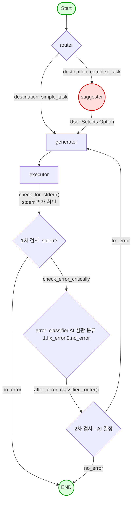

# Interactive AI Code Agent for Jupyter

[](https://www.python.org/downloads/)
[](https://opensource.org/licenses/MIT)

**LangGraph와 Human-in-the-Loop(HITL) 아키텍처를 기반으로, 사용자와의 협업을 통해 자율적으로 코드를 실행하고 디버깅하며 모든 과정을 `.ipynb` 파일로 기록하는 지능형 AI 코드 에이전트입니다.**

이 프로젝트는 기존 자율 AI 에이전트의 '예측 불가능성' 문제를 해결하는 것을 목표로 합니다. 완전 자율 대신 **'인간-AI 협업'**에 초점을 맞춰, AI가 안정적으로 사용자의 의도를 파악하고 제어 가능한 범위 내에서 작업을 수행하도록 설계되었습니다.

## 🌟 데모 (CLI in Action)



<br>

## 🚀 핵심 기능 (Core Features)

### 🧠 1. 지능형 작업 라우팅 (Intelligent Task Routing)
- `router` 노드가 사용자의 명령을 분석하여  
  - 단순 작업 → **즉시 실행**  
  - 복잡 작업 → **HITL 루프로 분기**

### 🤝 2. 인간 참여형 루프 (Human-in-the-Loop)
- `option_suggester`가 다음 AI 행동 옵션을 제안  
- 사용자는 옵션 선택 또는 직접 명령 입력  
- AI의 진행 방향을 **완전 제어** 가능

### 🛠️ 3. 자율적 오류 수정 (Autonomous Self-Correction)
- 실행 중 오류 발생 시 자동 디버깅 루프 진입  
- `code_generator`가 오류 메시지를 기반으로  
  - 코드 수정  
  - 라이브러리 설치  
  등의 해결책을 스스로 생성 후 재실행

### 🔍 4. 사전 예방적 자가 테스트 (Proactive Self-Testing)
- 생성된 코드에 `assert`, 테스트용 `print` 등을 자동 삽입  
- 실행 전 오류를 **미리 감지**하도록 설계

### 📑 5. 동적 Jupyter 노트북 생성
- 사용자 명령, AI 계획, 실행 코드, stdout/stderr, 이미지 출력까지  
  **실시간으로 `.ipynb`에 누적 기록**

### 🎨 6. 풍부한 CLI UX
- `rich`, `pyfiglet`, `inquirerpy` 기반  
- 컬러 패널, ASCII 로고, 인터랙티브 메뉴 제공

---

## 🏗️ 아키텍처 (Architecture)

본 에이전트는 **LangGraph 기반 상태 머신(Stateful Graph)** 구조이며, 각 노드의 명확한 역할과 조건부 분기를 통해 예측 가능한 흐름을 보장합니다.

### 워크플로우 다이어그램


### 노드 설명
- **Router**: 작업을 simple vs complex로 분류  
- **Suggester**: 복잡 작업 시 다음 행동 옵션 제안 (HITL)  
- **Generator**: 전문가 모드 + 자가 테스트 규칙 기반 코드 생성  
- **Executor**: JupyterExecutor로 코드 실행 및 결과 기록  
- **Error Loop**: stderr 감지 → 분류 → 수정 → 재실행

---

## 🛠️ 기술 스택 (Tech Stack)

| 구분 | 기술 | 사용 목적 |
|------|------|------------|
| 언어 | Python 3.10+ | 메인 개발 |
| AI 프레임워크 | LangGraph, LangChain | 상태 기반 에이전트 |
| LLM | OpenAI GPT-4o | 분류, 옵션 제안, 코드 생성 |
| Jupyter 제어 | jupyter_client, nbformat | 동적 .ipynb 생성 |
| 상태/데이터 | Pydantic | 구조화된 출력 정의 |
| CLI | rich, inquirerpy, pyfiglet | 인터랙티브 CLI |

---

## 🚀 설치 및 사용법 (Setup & Usage)

### 1. 프로젝트 클론
```bash
git clone (https://github.com/jongjin97/jupyter-llm.git)
cd jupyter-llm
```

### 2. 가상환경 & 의존성 설치
```bash
python -m venv .venv
# Windows
.\.venv\Scripts\activate
# macOS / Linux
source .venv/bin/activate

pip install -r requirements.txt
```

### 3. 환경 변수 설정
`.env` 파일 생성:
```bash
OPENAI_API_KEY="sk-..."
```

### 4. 에이전트 실행
```bash
python -m src.main
```

---

## 🔬 문제 해결 기록 (Troubleshooting)

### ✔ RecursionError (무한 루프)
- 에이전트가 과거 작업 히스토리를 기억하지 못함  
→ `history` 필드를 AgentState에 추가해 해결

### ✔ TypeError: not serializable
- JupyterExecutor를 상태에 저장하며 발생  
→ 도구를 상태에서 분리하여 **외부 주입 방식**으로 해결

### ✔ AttributeError: 'dict' object has no attribute 'cells'
- LangGraph 체크포인터가 nbformat 객체를 dict로 변환  
→ 노드 진입 시 `nbformat.from_dict()`로 재조립

### ✔ CLI 출력 중복 및 기억 상실
- session_history 관리 오류  
→ 상태 변화 감지 로직 추가 + 히스토리 유지 보정

### ✔ CLI 렌더링 문제
- rich 자동 구문 강조와 터미널 테마 충돌  
→ `Text(code)`로 강조 비활성화하여 해결

### ✔ 사후 대응형 디버깅의 한계
- code_generator가 **assert 포함 자가 테스트 코드**를 함께 생성하도록 개선

---

## 📈 프로젝트 회고 및 배운 점

### 🙌 What I Learned
- LangGraph 기반 **예측 가능하고 안전한 AI Agent 설계**  
- HITL 구조의 실용성과 안정성  
- Jupyter 환경을 제어하는 프로그래밍적 접근  
- State(직렬화 가능) vs Tool(라이브 객체) 명확한 분리의 중요성

### 🚀 Future Work
- **자동 도구 생성(Automated Tool Generation)**  
- **문서 분석 전문가(RAG) 강화**  
- **대용량 파일 탐색기(Interactive Browser) 추가**  

---

## 📄 라이선스 (License)

본 프로젝트는 **MIT License**를 따릅니다.

